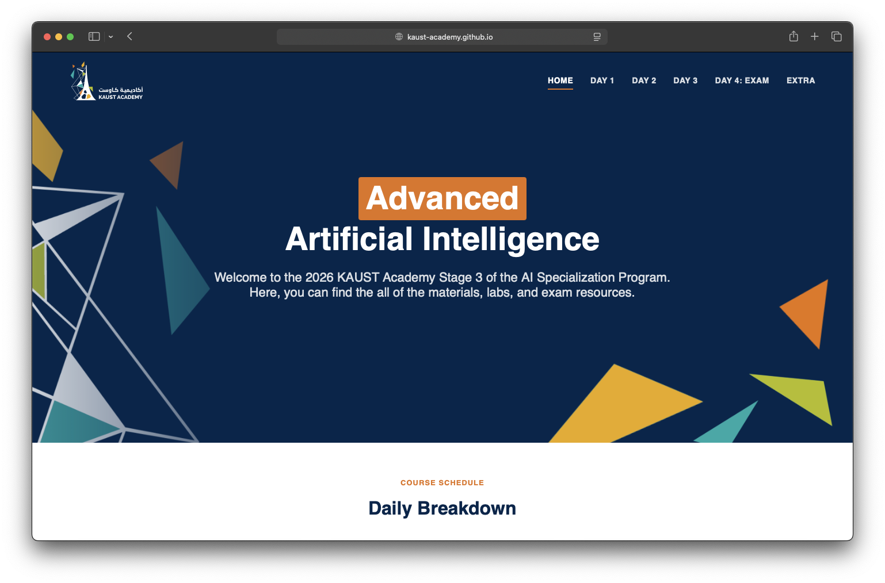

# KAUST Academy 2026 - Advanced AI (Stage 3)

Welcome to the **KAUST Academy 2026 Stage 3** of the AI Specialization Program. This repository contains all materials, labs, and exam resources for the Advanced Artificial Intelligence course.

## Program Venues

The program is held at the following universities:

- King Abdullah University of Science and Technology (KAUST)
- King Abdulaziz University
- King Fahd University of Petroleum and Minerals
- Princess Nourah bint Abdulrahman University
- University of Prince Muqrin
- Umm Al-Qura University

## 📚 Course Materials

Access the course content through our GitHub Pages site:

  

<h3 align="center">
  <a href="https://kaust-academy.github.io/KAUST_Academy_2026_Advanced_AI/">
    🔗 Access Content Website
  </a>
</h3>

---

## 📅 Schedule

### All Venues (Except KAUST)

| Date | Day | Time | Content |
|------|-----|------|---------|
| Monday, Feb 2nd | Day 1 (Part 1) | 4:00 PM - 8:00 PM | [Day 1 Content](https://kaust-academy.github.io/KAUST_Academy_2026_Advanced_AI/day1.html) |
| Tuesday, Feb 3rd | Day 1 (Part 2) | 4:00 PM - 8:00 PM | [Day 1 Content](https://kaust-academy.github.io/KAUST_Academy_2026_Advanced_AI/day1.html) |
| Wednesday, Feb 4th | Day 2 (Part 1) | 4:00 PM - 8:00 PM | [Day 2 Content](https://kaust-academy.github.io/KAUST_Academy_2026_Advanced_AI/day2.html) |
| Thursday, Feb 5th | Day 2 (Part 2) | 4:00 PM - 8:00 PM | [Day 2 Content](https://kaust-academy.github.io/KAUST_Academy_2026_Advanced_AI/day2.html) |
| Friday, Feb 6th | Day 3 | 9:00 AM - 5:00 PM | [Day 3 Content](https://kaust-academy.github.io/KAUST_Academy_2026_Advanced_AI/day3.html) |
| Saturday, Feb 7th | Day 4 | 9:00 AM - 5:00 PM | [Exam](https://kaust-academy.github.io/KAUST_Academy_2026_Advanced_AI/day4.html) |

### KAUST Venue

| Date | Day | Time | Content |
|------|-----|------|---------|
| Wednesday, Feb 4th | Day 1 | 9:00 AM - 5:00 PM | [Day 1 Content](https://kaust-academy.github.io/KAUST_Academy_2026_Advanced_AI/day1.html) |
| Thursday, Feb 5th | Day 2 | 9:00 AM - 5:00 PM | [Day 2 Content](https://kaust-academy.github.io/KAUST_Academy_2026_Advanced_AI/day2.html) |
| Friday, Feb 6th | Day 3 | 9:00 AM - 5:00 PM | [Day 3 Content](https://kaust-academy.github.io/KAUST_Academy_2026_Advanced_AI/day3.html) |
| Saturday, Feb 7th | Day 4 | 9:00 AM - 5:00 PM | [Exam](https://kaust-academy.github.io/KAUST_Academy_2026_Advanced_AI/day4.html) |

## License

Licensed under GPL-3.0.

> ⚠️ **Important:** Recording and uploading lectures online is not permitted.
